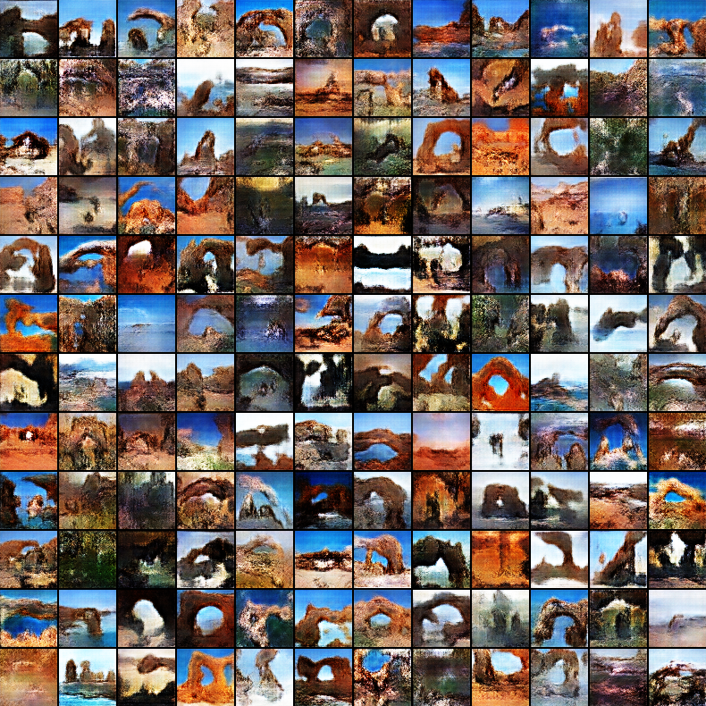
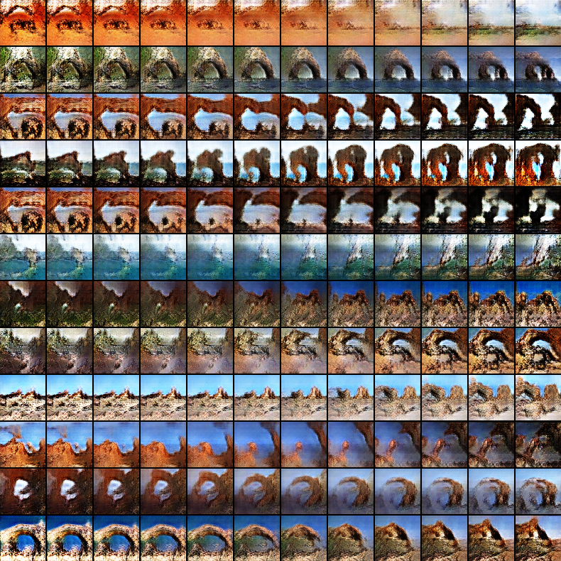

# Cooperative Learning of Energy-Based Model and Latent Variable Model via MCMC Teaching

This repository contains a tensorflow implementation for the paper "[Cooperative Learning of Energy-Based Model and Latent Variable Model via MCMC Teaching](http://www.stat.ucla.edu/~ywu/CoopNets/doc/CoopNets_AAAI.pdf)".
(http://www.stat.ucla.edu/~ywu/CoopNets/main.html)

## Requirements
- Python 2.7 or Python 3.3+
- [Tensorflow r1.0+](https://www.tensorflow.org/install/)
- [Scipy](https://www.scipy.org/install.html)
- [pillow](https://pillow.readthedocs.io/en/latest/installation.html)

## Usage

First, download Imagenet-scene dataset and save it to `./data` directory:

    $ python download.py scene

To train a model with ***alp*** dataset:

    $ python main.py --category alp --data_dir ./data/scene --output_dir ./output --num_epochs 300 --batch_size 100 --d_lr 0.01 --g_lr 0.0001
synthesized results will be saved in `./output/alp/synthesis`

To test generator by synthesizing interpolation results with trained model:

    $ python main.py --test --sample_size 144 --category alp --output_dir ./output --ckpt ./output/alp/checkpoints/model.ckpt
testing results will be saved in `./output/alp/test`

## Results
### Results of [MIT Place205](http://places.csail.mit.edu) dataset
**Descriptor result**

**Generator result**

**Interpolation result**

## Reference
    @inproceedings{coopnets,
        author = {Xie, Jianwen and Lu, Yang and Gao, Ruiqi and Wu, Ying Nian},
        title = {Cooperative Learning of Energy-Based Model and Latent Variable Model via MCMC Teaching},
        booktitle = {The 32nd AAAI Conference on Artitifical Intelligence},
        year = {2018}
    }
    
For any questions, please contact Jianwen Xie (jianwen@ucla.edu) and Zilong Zheng (zilongzheng0318@ucla.edu)
